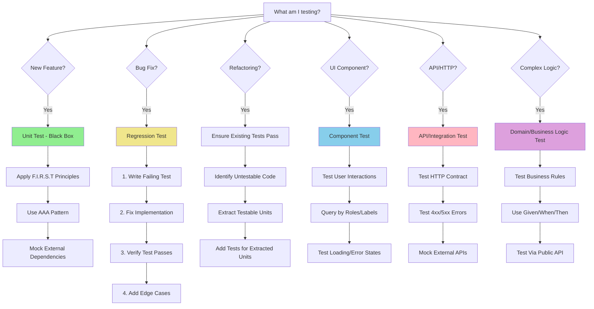
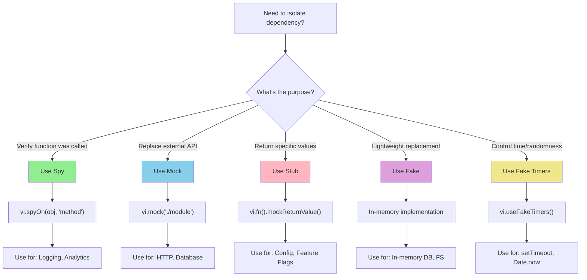
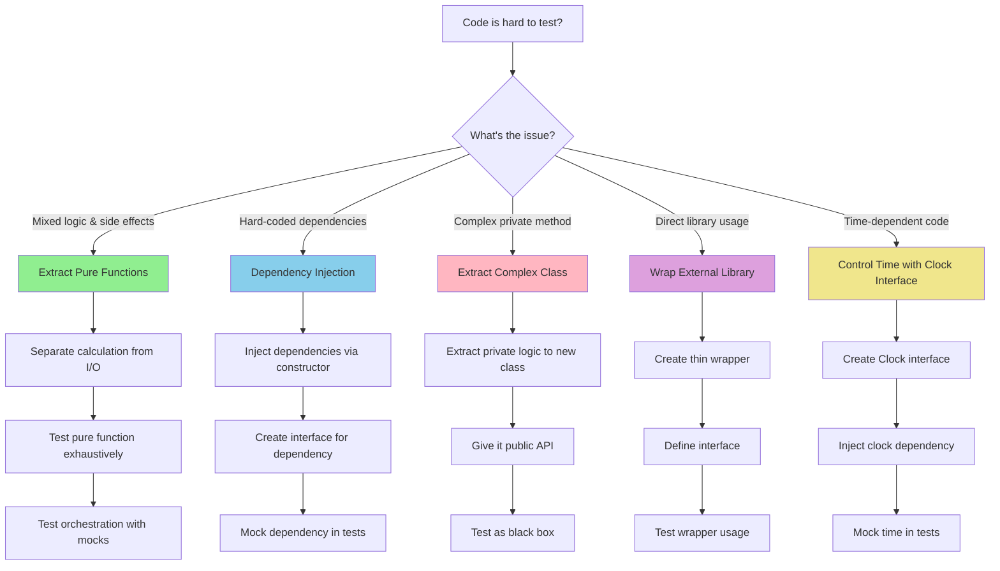
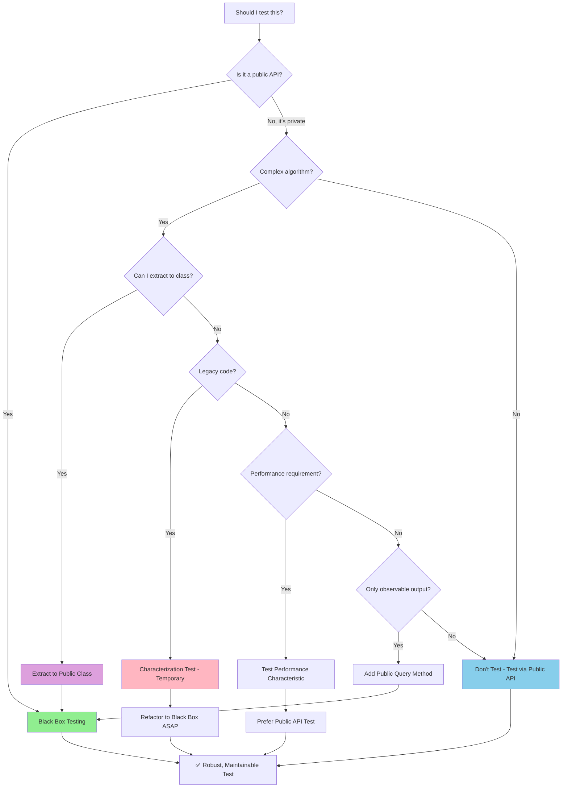
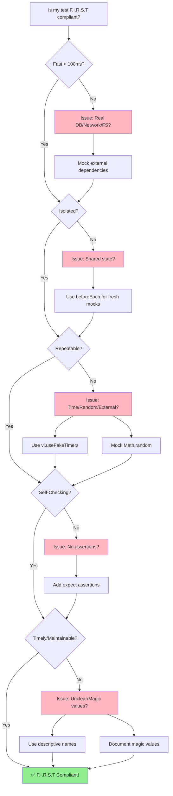

# Visual Decision Trees

**Visual flowcharts and decision diagrams for quick test strategy selection.**

This guide provides visual decision trees to help you quickly determine the right testing approach for any scenario.

---

## 🎯 Main Decision Tree: What Test Should I Write?



---

## 🔀 Test Double Selection Tree



---

## 🏗️ Testability Refactoring Decision Tree



---

## 🎯 Black Box vs White Box Decision Tree



---

## 🔄 F.I.R.S.T Compliance Check



---

## 🧪 Test Type Selection Matrix

```
┌─────────────────────────────────────────────────────────────────┐
│                     WHAT AM I TESTING?                          │
└─────────────────────────────────────────────────────────────────┘
                              │
                ┌─────────────┼─────────────┐
                │             │             │
           ┌────▼────┐   ┌────▼────┐  ┌────▼────┐
           │ Layer?  │   │ Scope?  │  │ Focus?  │
           └────┬────┘   └────┬────┘  └────┬────┘
                │             │             │
    ┌───────────┼──────┐      │      ┌──────┼──────┐
    │           │      │      │      │      │      │
┌───▼───┐  ┌───▼───┐ │  ┌───▼───┐ │ ┌────▼───┐ ┌▼────┐
│ Unit  │  │ Integ │ │  │ E2E   │ │ │Behavior│ │Perf │
│ Test  │  │ Test  │ │  │ Test  │ │ │ Test   │ │Test │
└───┬───┘  └───┬───┘ │  └───┬───┘ │ └────┬───┘ └┬────┘
    │          │     │      │     │      │      │
    ├─ Single │     │      │     │      │      │
    │  function│     │      │     │      │      │
    ├─ Black  │     │      │     │      │      │
    │  box    │     │      │     │      │      │
    ├─ Fast   │     │      │     │      │      │
    │  < 10ms │     │      │     │      │      │
    │         │     │      │     │      │      │
    │         ├─ Multiple  │      │      │      │
    │         │  modules   │      │      │      │
    │         ├─ Real DB   │      │      │      │
    │         │  (optional)│      │      │      │
    │         ├─ Fast      │      │      │      │
    │         │  < 1s      │      │      │      │
    │         │            │      │      │      │
    │         │            ├─ Full flow  │      │
    │         │            ├─ Real deps  │      │
    │         │            ├─ UI testing │      │
    │         │            ├─ Slow       │      │
    │         │            │  > 5s       │      │
    │         │            │             │      │
    │         │            │     ├─ Business   │
    │         │            │     │  rules      │
    │         │            │     ├─ Given/When │
    │         │            │     │  Then       │
    │         │            │     │             │
    │         │            │     │      ├─ Benchmarks
    │         │            │     │      ├─ Memory
    │         │            │     │      ├─ Load test
    │         │            │     │      │
    └─────────┴────────────┴─────┴──────┴──────┴──────
         ↓           ↓        ↓      ↓       ↓
    patterns/   patterns/  patterns/ principles/ patterns/
    test-       async-     component bdd-      performance-
    doubles.md  testing.md testing.md integration testing.md
                                      .md
```

---

## 🔧 Refactoring for Testability Flow

```
┌──────────────────────────────────────────────────┐
│ Is my code hard to test?                         │
└──────────────────┬───────────────────────────────┘
                   │
                   ▼
        ┌──────────────────────┐
        │ Identify the problem │
        └──────────┬───────────┘
                   │
    ┌──────────────┼──────────────┬─────────────┬──────────────┐
    │              │              │             │              │
    ▼              ▼              ▼             ▼              ▼
┌───────┐    ┌──────────┐   ┌─────────┐  ┌─────────┐   ┌──────────┐
│Mixed  │    │Hard-coded│   │Complex  │  │Direct   │   │Time      │
│Logic &│    │Deps      │   │Private  │  │Library  │   │Dependent │
│Effects│    │          │   │Method   │  │Usage    │   │          │
└───┬───┘    └────┬─────┘   └────┬────┘  └────┬────┘   └────┬─────┘
    │             │              │           │             │
    ▼             ▼              ▼           ▼             ▼
┌───────────┐ ┌──────────┐  ┌─────────┐ ┌─────────┐  ┌──────────┐
│Extract    │ │Inject    │  │Extract  │ │Create   │  │Inject    │
│Pure       │ │via       │  │to New   │ │Wrapper  │  │Clock     │
│Functions  │ │Constructor│ │Class    │ │Interface│  │Interface │
└─────┬─────┘ └─────┬────┘  └────┬────┘ └────┬────┘  └────┬─────┘
      │             │             │           │             │
      ▼             ▼             ▼           ▼             ▼
┌──────────────────────────────────────────────────────────────┐
│ Test pure logic exhaustively + Test orchestration with mocks│
└──────────────────────────────────────────────────────────────┘
```

**Reference:** [testability-patterns.md](../refactoring/testability-patterns.md)

---

## 🎭 Mock Strategy Selector

```
Need to isolate a dependency?
│
├─ What do you need to verify?
│
├─ ❓ "Was this function called?"
│  └─ 🎯 Use SPY
│     └─ vi.spyOn(object, 'method')
│     └─ Example: Logger, Analytics, Event tracking
│
├─ ❓ "Replace external system (API/DB)"
│  └─ 🎯 Use MOCK
│     └─ vi.mock('./module')
│     └─ Example: HTTP client, Database, Email service
│
├─ ❓ "Return specific value"
│  └─ 🎯 Use STUB
│     └─ vi.fn().mockReturnValue(value)
│     └─ Example: Configuration, Feature flags
│
├─ ❓ "Need working but simplified implementation"
│  └─ 🎯 Use FAKE
│     └─ Custom in-memory implementation
│     └─ Example: In-memory DB, Fake file system
│
└─ ❓ "Control time or randomness"
   └─ 🎯 Use FAKE TIMERS
      └─ vi.useFakeTimers(), vi.setSystemTime()
      └─ Example: setTimeout, Date.now(), Math.random()
```

**Reference:** [test-doubles.md](../patterns/test-doubles.md)

---

## 📋 Test Structure Checklist Flow

```
Writing a test?
│
├─ Step 1: ARRANGE (Given)
│  ├─ ✅ Create system under test
│  ├─ ✅ Set up test data
│  ├─ ✅ Configure mocks
│  ├─ ✅ Define expected values
│  └─ ❌ Don't execute behavior yet
│
├─ Step 2: ACT (When)
│  ├─ ✅ Call ONE public method
│  ├─ ✅ Capture result or exception
│  └─ ❌ Don't call multiple methods
│
└─ Step 3: ASSERT (Then)
   ├─ ✅ Verify expected outcome
   ├─ ✅ Check return value
   ├─ ✅ Verify state changes
   ├─ ✅ Verify mock interactions
   └─ ❌ Don't perform additional actions
```

**Reference:** [aaa-pattern.md](../principles/aaa-pattern.md)

---

## 🚦 Test Coverage Strategy

```
┌─────────────────────────────────────────────┐
│         Testing Pyramid                     │
│                                             │
│              /\                             │
│             /  \     E2E Tests              │
│            /    \    (Few)                  │
│           /──────\   - Full user flows     │
│          /        \  - Critical paths      │
│         /          \ - UI integration      │
│        /────────────\                      │
│       /              \ Integration Tests   │
│      /                \ (Some)             │
│     /                  \ - API contracts   │
│    /                    \ - DB queries     │
│   /──────────────────────\ - Module integ  │
│  /                        \                │
│ /                          \ Unit Tests    │
│/____________________________\ (Many)       │
│                              - Pure logic  │
│                              - Business    │
│                              - Fast        │
└─────────────────────────────────────────────┘
```

**Where to focus:**
- **70-80%** Unit tests (fast, isolated, black box)
- **15-20%** Integration tests (API, database, modules)
- **5-10%** E2E tests (critical user flows)

**Reference:** [testing-pyramid.md](../principles/testing-pyramid.md) _(to be created)_

---

## 🎨 Component Testing Decision Flow

```
Testing a React/Vue component?
│
├─ Step 1: What are you testing?
│  ├─ Rendering → Use screen.getByRole()
│  ├─ User interaction → Use userEvent.click()
│  ├─ State changes → Test observable output
│  ├─ Props → Render with different props
│  └─ Async data → Test loading/error/success states
│
├─ Step 2: How to query elements?
│  ├─ ✅ PREFER: getByRole (accessibility)
│  ├─ ✅ GOOD: getByLabelText (forms)
│  ├─ ✅ OK: getByText (visible text)
│  ├─ ⚠️  AVOID: getByTestId (implementation detail)
│  └─ ❌ NEVER: querySelector (CSS coupling)
│
├─ Step 3: How to interact?
│  ├─ ✅ PREFER: userEvent.click(), userEvent.type()
│  ├─ ⚠️  OK: fireEvent (for simple cases)
│  └─ ❌ AVOID: Calling component methods directly
│
└─ Step 4: What to assert?
   ├─ ✅ Rendered output (text, attributes)
   ├─ ✅ Callback invocations (onClick, onSubmit)
   ├─ ✅ Accessibility (roles, labels)
   └─ ❌ Component internal state
```

**Reference:** [component-testing.md](../patterns/component-testing.md)

---

## 🌐 API Testing Decision Flow

```
Testing an API or HTTP client?
│
├─ What to test?
│  ├─ Happy path (200/201)
│  │  └─ Request structure (method, headers, body)
│  │  └─ Response parsing
│  │  └─ Data transformation
│  │
│  ├─ Client errors (4xx)
│  │  ├─ 400 Bad Request
│  │  ├─ 401 Unauthorized → Test auth flow
│  │  ├─ 404 Not Found → Test error handling
│  │  └─ 409 Conflict → Test business rule errors
│  │
│  ├─ Server errors (5xx)
│  │  ├─ 500 Internal Server Error
│  │  ├─ 503 Service Unavailable → Test retry logic
│  │  └─ 504 Gateway Timeout → Test timeout handling
│  │
│  └─ Network errors
│     ├─ Connection failures
│     ├─ Timeouts
│     └─ DNS errors
│
└─ How to mock?
   ├─ Simple: vi.fn() for fetch
   ├─ Realistic: MSW (Mock Service Worker)
   └─ Full integration: Test container with real API
```

**Reference:** [api-testing.md](../patterns/api-testing.md)

---

## 📊 Async Testing Decision

```
Testing async code?
│
├─ Type of async?
│  │
│  ├─ Promises
│  │  └─ await expect(promise).resolves.toBe()
│  │  └─ await expect(promise).rejects.toThrow()
│  │
│  ├─ Async/Await Functions
│  │  └─ Make test async: it('test', async () => {})
│  │  └─ Always await: await functionCall()
│  │
│  ├─ Callbacks (legacy)
│  │  └─ Convert to promises
│  │  └─ Use util.promisify()
│  │
│  └─ Timers (setTimeout/setInterval)
│     └─ vi.useFakeTimers()
│     └─ vi.advanceTimersByTime(ms)
│     └─ await vi.runAllTimersAsync()
│
└─ Testing loading states?
   ├─ Mock that never resolves → Test loading
   ├─ Mock that resolves → Test success
   └─ Mock that rejects → Test error
```

**Reference:** [async-testing.md](../patterns/async-testing.md)

---

## 🎯 Quick Pattern Lookup

| I need to... | Use this pattern | Reference |
|--------------|------------------|-----------|
| Mock a function | `vi.fn()` | [test-doubles.md](../patterns/test-doubles.md#stub) |
| Mock a module | `vi.mock('./module')` | [test-doubles.md](../patterns/test-doubles.md#mock) |
| Spy on object method | `vi.spyOn(obj, 'method')` | [test-doubles.md](../patterns/test-doubles.md#spy) |
| Control time | `vi.useFakeTimers()` | [async-testing.md](../patterns/async-testing.md#timer-mocking) |
| Test async function | `async/await` + `expect().resolves` | [async-testing.md](../patterns/async-testing.md) |
| Test React component | Testing Library | [component-testing.md](../patterns/component-testing.md) |
| Test API client | Mock fetch or MSW | [api-testing.md](../patterns/api-testing.md) |
| Test errors | `expect(() => {}).toThrow()` | [error-testing.md](../patterns/error-testing.md) |
| Make code testable | Extract pure functions | [testability-patterns.md](../refactoring/testability-patterns.md) |
| Generate test data | Test factories | [test-data.md](../patterns/test-data.md) |

---

## 🎨 ASCII Decision Tree: Start Here

```
                    ┌─────────────────────────┐
                    │  What am I testing?     │
                    └───────────┬─────────────┘
                                │
                ┌───────────────┼───────────────┐
                │               │               │
            New Feature     Bug Fix        Refactoring
                │               │               │
                ▼               ▼               ▼
        ┌───────────────┐  ┌──────────┐  ┌─────────────┐
        │ Unit Test     │  │Regression│  │ Ensure      │
        │ (Black Box)   │  │Test      │  │ Tests Pass  │
        └───┬───────────┘  └────┬─────┘  └──────┬──────┘
            │                   │                │
            ▼                   ▼                ▼
        F.I.R.S.T          Write Failing     Extract
        Principles         Test First         Testable Units
            │                   │                │
            ▼                   ▼                ▼
        AAA Pattern        Fix Code          Add Granular
                                             Tests
            │                   │                │
            ▼                   ▼                ▼
        Mock External      Verify Pass       All Tests
        Dependencies                         Pass
            │                   │                │
            └───────────────────┴────────────────┘
                                │
                                ▼
                        ✅ Test Complete
```

---

## 🔗 Related Guides

- **[Main Decision Tree](../index.md)** - Detailed scenarios with examples
- **[F.I.R.S.T Principles](../principles/first-principles.md)** - Quality checklist
- **[AAA Pattern](../principles/aaa-pattern.md)** - Test structure
- **[Testability Patterns](../refactoring/testability-patterns.md)** - Refactoring guide

---

## 💡 How to Use These Diagrams

### For Quick Decisions
1. Start with "Main Decision Tree"
2. Follow the path based on your scenario
3. Jump to the referenced file for details

### For Learning
1. Review each decision tree
2. Understand the branching logic
3. Practice applying to real scenarios

### For Code Reviews
1. Use trees as checklists
2. Verify proper pattern selection
3. Check test quality compliance

---

**Tip:** Bookmark this page for quick access during development!
