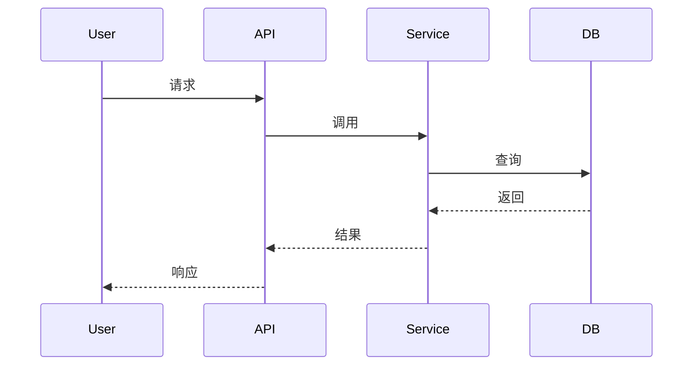

# 敏捷设计文档生成

## 核心原则

### 1. MVP导向，避免过度设计
- 敏捷开发以快速迭代为目标，不需要考虑所有边界情况
- 专注于核心功能，次要功能可以后续迭代
- 不要为了"完整性"而添加不必要的功能

### 2. 基于现有技术栈
- 必须先读取项目配置文件（pyproject.toml、package.json等）了解技术栈
- 复用现有组件，避免重复造轮子
- 设计方案必须与当前技术栈兼容

### 3. 清晰阐述设计意图
- 明确本次设计解决的问题或提供的功能
- 使用mermaid时序图展示交互流程
- 针对每个功能点给出实现思路和关键方法
- 复杂逻辑使用mermaid实现流程
- 提供示例代码说明关键实现

### 4. 精炼文档，面向技术人员
- 读者是开发者和了解业务的产品人员
- 避免冗长的背景介绍和废话
- 先了解现有组件，避免重复设计

## 工作流程

### 第一步：前置分析

在生成设计文档之前，必须先完成以下分析：

#### 1.1 了解项目背景
```
询问用户或分析项目：
- 项目背景？现在是什么系统，要做什么功能/模块？
```

#### 1.2 识别技术栈
```
必须读取的配置文件：
- Python项目：pyproject.toml, requirements.txt, setup.py
- Node.js项目：package.json, yarn.lock, pnpm-lock.yaml
- Java项目：pom.xml, build.gradle
- Go项目：go.mod, go.sum
- 其他：根据项目类型识别

分析内容：
- 主要框架和库
- 数据库和存储
- 消息队列和中间件
- 部署和运维工具
```

#### 1.3 了解现有组件
```
通过以下方式了解现有组件：
1. 询问用户：有哪些现有组件可以复用？
2. 读取项目结构：分析src/、lib/、components/等目录
3. 查看文档：README.md、docs/等

记录可复用的组件：
- 基础服务类
- 工具函数
- 中间件
- 数据模型
```

### 第二步：设计文档生成

按照以下结构生成设计文档：

#### 2.1 设计目标（1-2段）
```
明确说明：
- 本次设计要解决什么问题
- 提供什么功能
```

#### 2.2 功能列表（简洁列表）
```
简要列出本次设计的功能点：
- 功能1：一句话描述
- 功能2：一句话描述
- 功能3：一句话描述

不要展开详细说明，保持简洁
```

#### 2.3 交互流程（Mermaid时序图）
```
为每个主要功能绘制时序图：


时序图目的：
- 展示组件间的交互顺序
- 明确系统边界
- 识别外部依赖
```

#### 2.4 实现方案（核心部分）

针对每个功能点，按以下结构描述：

**功能点名称**

*实现思路*（2-3句话）
- 说明采用的技术方案
- 为什么选择这个方案
- 与现有组件的集成方式

*关键方法*（代码示例）
```python
# 示例：用户认证
def authenticate_user(token: str) -> User:
    """验证用户token并返回用户信息"""
    # 1. 验证token格式
    # 2. 从缓存或数据库查询
    # 3. 返回用户信息
    pass
```

*技术难点*（如有）
- 描述难点
- 说明解决方案
- 提供参考链接或示例

#### 2.5 数据模型（如需要）
```
仅列出新增或修改的数据模型：
- User: {id, name, email}
- Order: {id, userId, amount, status}

使用简洁的表格或JSON格式
```

#### 2.6 接口定义（如需要）
```
仅列出新增或修改的API：
POST /api/users
- 请求：{name, email}
- 响应：{id, name, email, createdAt}

保持简洁，不要展开所有字段
```

### 第三步：质量检查

生成文档后，进行以下检查：

#### 3.1 精炼度检查
- [ ] 是否有冗长的背景介绍？
- [ ] 是否有重复的内容？
- [ ] 是否可以删除某些章节而不影响理解？

#### 3.2 重点突出检查
- [ ] 设计目标是否清晰？
- [ ] 功能列表是否简洁？
- [ ] 时序图是否展示了核心交互？
- [ ] 实现方案是否提供了关键方法？

#### 3.3 技术准确性检查
- [ ] 技术栈是否与项目一致？
- [ ] 是否复用了现有组件？
- [ ] 代码示例是否正确？

#### 3.4 MVP导向检查
- [ ] 是否包含了不必要的功能？
- [ ] 是否可以简化某些设计？
- [ ] 是否有可以后续迭代的内容？

## 常见问题处理

### Q1: 用户没有提供足够信息
```
优先级顺序：
1. 读取项目文件（pyproject.toml、package.json等）
2. 分析项目结构
3. 询问用户具体问题
4. 基于常见模式做合理假设（并在文档中说明）
```

### Q2: 不确定是否需要某个功能
```
原则：
- 如果是核心功能，必须包含
- 如果是辅助功能，可以后续迭代
- 如果不确定，询问用户
- 在文档中明确标注"可选"或"后续迭代"
```

### Q3: 技术栈不熟悉
```
处理方式：
1. 读取项目配置文件了解技术栈
2. 搜索相关文档和最佳实践
3. 参考项目现有代码的实现方式
4. 在文档中说明技术选型的理由
```

## 参考资源

- [设计文档模板](references/template.md) - 标准设计文档模板
