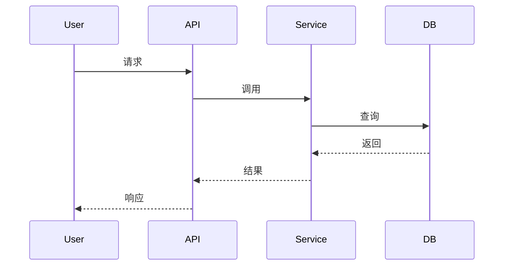

# 设计文档模板

## 设计目标

[1-2段文字说明本次设计要解决的问题和提供的功能]

## 功能列表

- [功能1]：[一句话描述]
- [功能2]：[一句话描述]
- [功能3]：[一句话描述]

## 交互流程

### [主要功能1]流程



## 实现方案

### [功能点1]

**实现思路**
[2-3句话说明技术方案和集成方式]

**关键方法**
```python
def example_method(param: str) -> Result:
    """方法说明"""
    # 实现逻辑
    pass
```

**技术难点**（如有）
- 难点描述
- 解决方案

### [功能点2]

**实现思路**
[2-3句话说明技术方案和集成方式]

**关键方法**
```python
def example_method(param: str) -> Result:
    """方法说明"""
    # 实现逻辑
    pass
```

## 数据模型

| 模型 | 字段 | 说明 |
|------|------|------|
| User | id, name, email | 用户信息 |
| Order | id, userId, amount | 订单信息 |

## 接口定义

### POST /api/users
创建用户

**请求**
```json
{
  "name": "string",
  "email": "string"
}
```

**响应**
```json
{
  "id": "string",
  "name": "string",
  "email": "string",
  "createdAt": "datetime"
}
```
