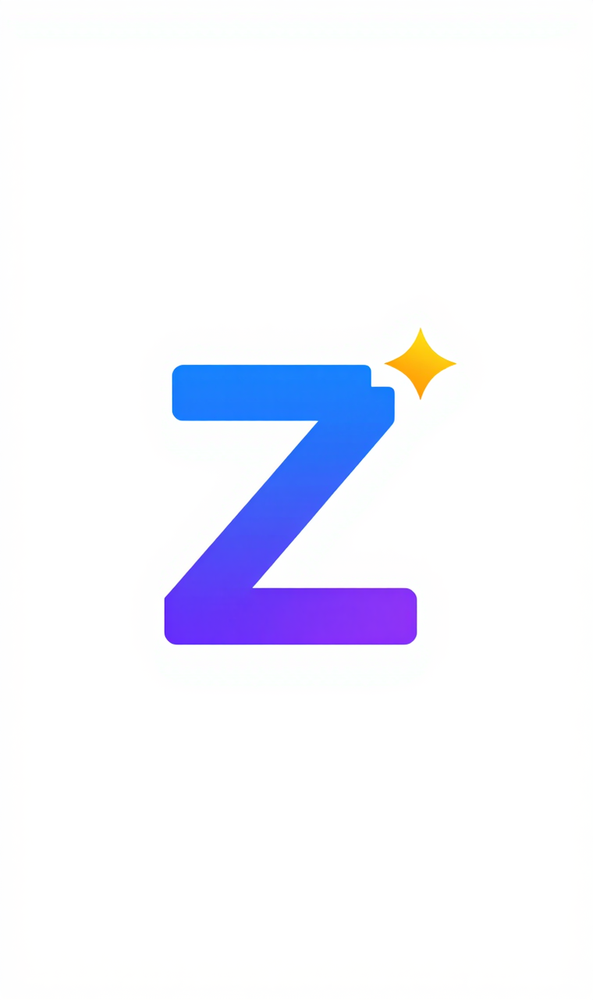

# Z-Image Skill - AI 图片生成技能

<p align="center">
  
</p>

> 让 Claude Code 帮你用自然语言生成精美图片！

[English](./README.md) | 中文

## 这是什么？

Z-Image Skill 是一个 Claude Code 技能插件，让你可以用简单的中文或英文描述，自动生成 AI 图片。

**你只需要这样说：**
- "帮我生成一张金色的猫咪图片"
- "画一幅日落下的山脉"
- "创建一个可爱的卡通头像"

Claude Code 就会自动帮你生成图片！

## 效果展示

```
你：帮我生成一张赛博朋克风格的城市夜景

Claude：好的，我来帮你生成这张图片...
        Task started: xxx
        Image saved to: cyberpunk_city.jpg

        图片已生成！保存在 cyberpunk_city.jpg
```

## 安装步骤

> 所有步骤都可以在 Claude Code 中用自然语言完成，无需手动输入命令！

### 第一步：获取免费 API Key

1. 访问 [ModelScope 官网](https://modelscope.cn)
2. 点击右上角「登录/注册」
3. 登录后，访问 [API Token 页面](https://modelscope.cn/my/myaccesstoken)
4. 点击「创建 Token」，复制生成的 API Key

### 第二步：安装技能

打开 Claude Code，直接说：

```
帮我安装 zimage-skill，仓库地址是 https://github.com/yizhiyanhua-ai/zimage-skill
```

Claude 会自动帮你完成：
- 下载技能到正确的目录
- 安装所需的 Python 依赖

### 第三步：配置 API Key

在 Claude Code 中说：

```
帮我配置 MODELSCOPE_API_KEY 环境变量，值是 ms-xxxxxxxx（替换成你的 API Key）
```

或者你也可以说：

```
帮我在 ~/.claude/settings.json 中添加环境变量 MODELSCOPE_API_KEY，值是 ms-xxxxxxxx
```

### 第四步：验证安装

重启 Claude Code 后，直接说：

```
帮我生成一张测试图片
```

如果看到图片生成成功，说明安装完成！

## 使用案例

### 基础用法

```
你：生成一张可爱的柴犬图片
你：画一个宇航员在月球上
你：创建一张抽象艺术画
```

### 指定保存路径

```
你：生成一张海边日落的图片，保存为 sunset.jpg
你：画一只熊猫，保存到 ~/Pictures/panda.png
```

### 详细描述获得更好效果

```
你：生成一张图片：一只橘色的猫咪坐在窗台上，窗外是下雨的城市夜景，
    温暖的室内灯光，电影感的构图，4K高清

你：画一幅画：中国水墨画风格的山水，远处有云雾缭绕的山峰，
    近处有一叶扁舟，意境悠远
```

### 不同风格示例

| 描述 | 效果 |
|------|------|
| "赛博朋克风格的东京街头" | 霓虹灯、未来感 |
| "吉卜力动画风格的森林" | 宫崎骏风格 |
| "油画风格的向日葵" | 梵高风格 |
| "极简主义的几何图案" | 现代设计感 |
| "中国风的锦鲤戏水" | 国画风格 |
| "像素艺术的游戏角色" | 复古游戏风 |

### 实用场景

**1. 制作头像**
```
你：生成一个可爱的卡通头像，女生，粉色头发，大眼睛，微笑
```

**2. 文章配图**
```
你：我在写一篇关于人工智能的文章，帮我生成一张科技感的配图
```

**3. 社交媒体素材**
```
你：生成一张适合发朋友圈的风景图，要有治愈感
```

**4. 设计灵感**
```
你：画一个 App 启动页的背景，渐变色，抽象，现代感
```

**5. 表情包制作**
```
你：生成一只惊讶的猫咪表情，卡通风格，夸张表情
```

## 常见问题

### Q: 提示 "MODELSCOPE_API_KEY environment variable is required"

A: 你还没有配置 API Key。请按照「安装步骤」中的第一步和第二步操作。

### Q: 图片生成失败或超时

A: 可能的原因：
- 网络连接问题，请检查网络
- API 服务繁忙，请稍后重试
- 描述内容可能触发了内容审核，请修改描述

### Q: 生成的图片质量不理想

A: 尝试以下方法：
- 使用更详细的描述
- 添加风格关键词（如：高清、4K、电影感、专业摄影）
- 指定艺术风格（如：油画风格、水彩风格、动漫风格）

### Q: 支持哪些图片格式？

A: 默认保存为 JPG 格式，也支持 PNG 格式（在文件名中指定即可）。

## 技术信息

- **模型**: Tongyi-MAI/Z-Image-Turbo
- **API 提供商**: ModelScope (阿里云)
- **超时时间**: 120 秒
- **支持语言**: 中文、英文

## 获取帮助

如果遇到问题，可以：
1. 查看上方「常见问题」
2. 在 GitHub 提交 Issue
3. 检查 API Key 是否正确配置

## 许可证

MIT License - 可自由使用和修改
